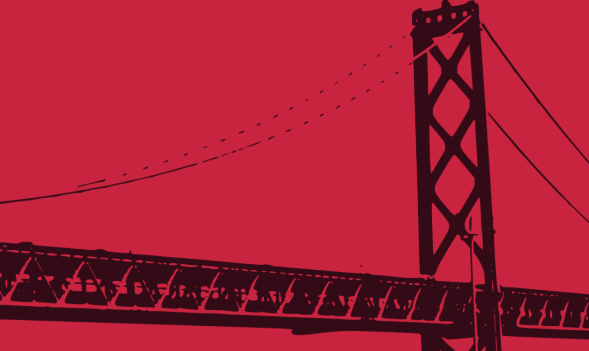

# [New for 2020](https://www.twitch.tv/videos/544250079)

With a new scene collection in OBS I'm trying out ideas and layouts. Creating scenes like backdrop, cam1, cam2 to switch between. Now with more dynamic manual scene changing technology.

Introducing the city and bay-bridge backdrops with a little randomness to them. A little [Fun with the Canvas API](https://developer.mozilla.org/en-US/docs/Web/API/Canvas_API)

Tested playing back some sound recorded in the field. Starting and revving a car. 

Oldgoat does not want to use the gold borders. Maybe I'll find another way to make use of them.

Oldgoat doesn't believe this is the original version of All by Myself, he's convinced it's a cover. I remember this from a movie but not able to place it.

https://open.spotify.com/album/3Faeb8KPVk4ntMz0GBGlJO?si=lTln-zUISiSYXPQvO2PraQ

## [7Days to Die tips](https://www.twitch.tv/myoldgoat/clip/PunchyObservantFiddleheadsStoneLightning)

Oldoat found some forged steel and created much needed tool repair kits by combining the steel with duct tape.

I used some sewing kits to make pocket mods to reduce encumbrance a little bit. They fit on your jacket, shirt and pants.

https://store.steampowered.com/app/251570/7_Days_to_Die/

